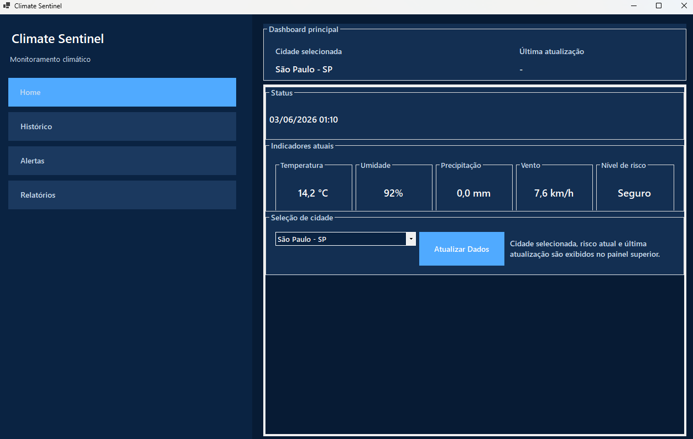
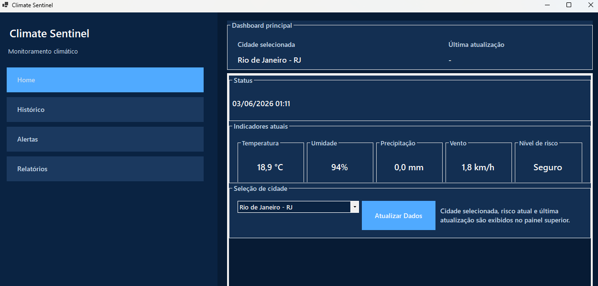
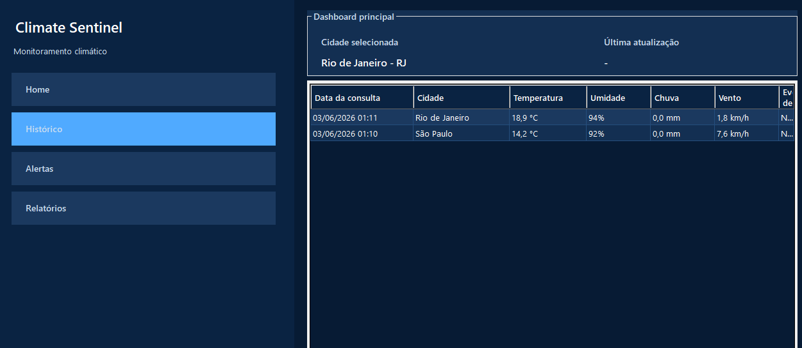
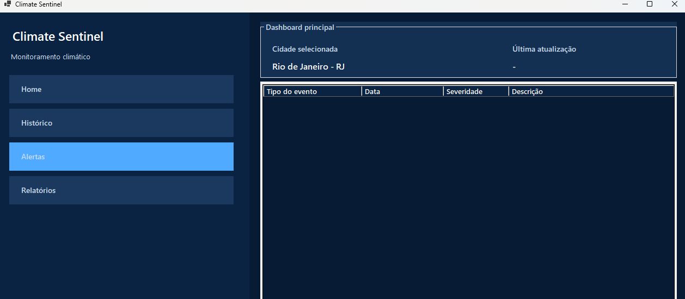
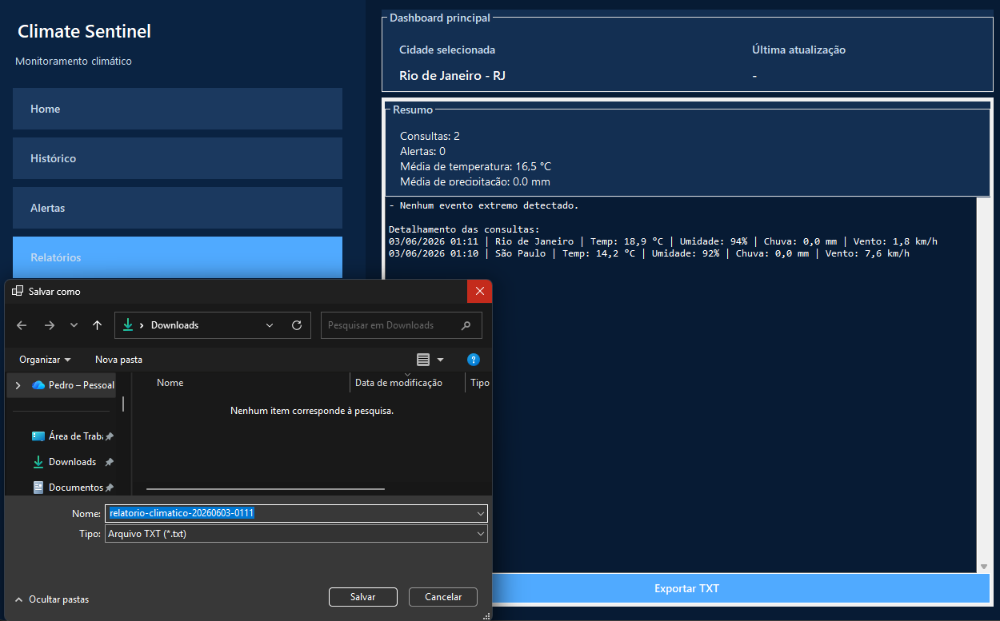
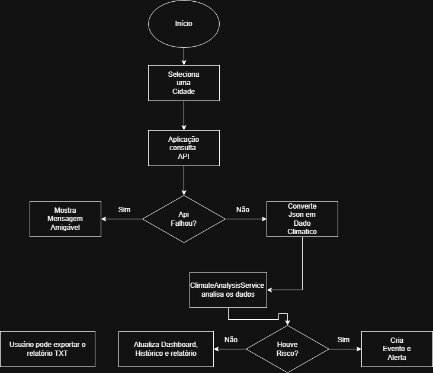

# Climate Sentinel

Sistema desktop desenvolvido em C# com .NET 8 e Windows Forms para monitoramento climático, consulta de dados meteorológicos reais e geração de alertas de risco com base em eventos extremos.

O projeto foi construído para atender ao tema da Global Solution, conectando tecnologia, dados climáticos e prevenção de desastres naturais.

## Integrantes

- Guilherme Santos Nunes – RM558989
- Kaique Rodrigues Zaffarani – RM556677
- Kairo da Silva Silvestre de Carvalho – RM558288
- Pedro Josué Pereira Almeida – RM554913

## Sumário

- [Objetivo da solução](#objetivo-da-solução)
- [Como a aplicação funciona](#como-a-aplicação-funciona)
- [Lógica de análise climática](#lógica-de-análise-climática)
- [Tecnologias utilizadas](#tecnologias-utilizadas)
- [Estrutura do projeto](#estrutura-do-projeto)
- [Conceitos de C# aplicados](#conceitos-de-c-aplicados)
- [Tratamento de exceções](#tratamento-de-exceções)
- [Relatórios e manipulação de arquivos](#relatórios-e-manipulação-de-arquivos)
- [Como executar](#como-executar)
- [Evidências de teste](#evidências-de-teste)
- [Diagramas](#diagramas)

## Objetivo da solução

O Climate Sentinel tem como objetivo auxiliar no monitoramento climático de cidades brasileiras, permitindo que o usuário consulte dados atuais de clima e identifique possíveis riscos associados a eventos extremos.

A aplicação permite visualizar:

- Cidade monitorada.
- Temperatura atual.
- Umidade do ar.
- Precipitação.
- Velocidade do vento.
- Nível de risco atual.
- Histórico de consultas.
- Alertas climáticos gerados.
- Relatório textual exportável em arquivo `.txt`.

## Como a aplicação funciona

O fluxo principal da aplicação é:

1. O usuário seleciona uma cidade monitorada.
2. O usuário clica em `Atualizar Dados`.
3. A aplicação consulta a API Open-Meteo usando latitude e longitude da cidade.
4. A resposta da API é convertida em um objeto de dados climáticos.
5. O serviço de análise verifica se há condições de risco.
6. A consulta é salva no histórico.
7. Caso algum risco seja detectado, um alerta climático é gerado.
8. A interface atualiza dashboard, histórico, alertas e relatório.
9. O usuário pode exportar o relatório em formato `.txt`.

## Lógica de análise climática

A análise de risco é feita pela classe `ClimateAnalysisService`.

Ela recebe:

- Os dados climáticos atuais.
- A cidade monitorada.

Com base nesses dados, a aplicação identifica eventos extremos usando regras simples:

| Condição | Evento detectado | Severidade |
| --- | --- | --- |
| Temperatura maior ou igual a 40 °C | Onda de calor | Crítico |
| Umidade menor ou igual a 20% | Seca | Alto |
| Precipitação maior ou igual a 80 mm | Enchente | Crítico |
| Velocidade do vento maior ou igual a 70 km/h | Tempestade | Crítico |

Quando nenhuma condição de risco é encontrada, a consulta é registrada normalmente no histórico, mas nenhum alerta é criado.

Quando uma ou mais condições são encontradas, a aplicação:

- Cria objetos de evento extremo.
- Gera alertas climáticos.
- Exibe esses alertas na tela de `Alertas`.
- Inclui os eventos no histórico e no relatório.

## Tecnologias utilizadas

- C#.
- .NET 8.
- Windows Forms.
- HttpClient.
- System.Text.Json.
- API Open-Meteo.

## Estrutura do projeto

```text
ClimateSentinel/
├── DTOs/
│   └── OpenMeteoResponseDto.cs
├── Exceptions/
│   ├── AnaliseClimaticaException.cs
│   └── ApiCommunicationException.cs
├── Forms/
│   └── MainForm.cs
├── Interfaces/
│   └── IClimateProvider.cs
├── Models/
│   ├── AlertaClimatico.cs
│   ├── CidadeMonitorada.cs
│   ├── CoordenadaGeografica.cs
│   ├── DadoClimatico.cs
│   ├── Enchente.cs
│   ├── EventoExtremo.cs
│   ├── MonitoramentoRegistro.cs
│   ├── OndaDeCalor.cs
│   ├── Seca.cs
│   └── Tempestade.cs
├── Providers/
│   └── OpenMeteoProvider.cs
├── Services/
│   ├── ClimateAnalysisService.cs
│   ├── RelatorioClimatico.Dados.cs
│   └── RelatorioClimatico.Geracao.cs
├── Utils/
│   ├── CityCatalog.cs
│   └── UiPalette.cs
└── Program.cs
```

## Conceitos de C# aplicados

### Programação orientada a objetos

O projeto utiliza classes de domínio para representar os principais elementos do sistema:

- `CidadeMonitorada`.
- `DadoClimatico`.
- `MonitoramentoRegistro`.
- `AlertaClimatico`.
- `EventoExtremo`.

### Encapsulamento

As entidades organizam seus próprios dados por meio de propriedades.

Exemplo:

- `CidadeMonitorada` armazena nome, estado, coordenadas e dados climáticos.
- `DadoClimatico` armazena temperatura, umidade, precipitação, vento e data/hora.

### Herança

A classe abstrata `EventoExtremo` representa um evento climático genérico.

As classes abaixo herdam dela:

- `Enchente`.
- `Seca`.
- `OndaDeCalor`.
- `Tempestade`.

### Polimorfismo

Cada evento extremo implementa sua própria versão do método `GerarDescricao()`.

Isso permite que a aplicação trate todos os eventos como `EventoExtremo`, mas obtenha descrições específicas para cada tipo de risco.

### Abstração

A classe `EventoExtremo` define uma base comum para eventos climáticos, sem representar diretamente um evento concreto.

### Interface

A interface `IClimateProvider` define o contrato para obtenção de dados climáticos.

A implementação atual é `OpenMeteoProvider`, responsável por consumir a API Open-Meteo.

### Struct

O projeto utiliza `readonly struct` em `CoordenadaGeografica`, representando latitude e longitude como um tipo simples, imutável e adequado para valor.

### Partial class

A classe `RelatorioClimatico` foi dividida em arquivos parciais:

- `RelatorioClimatico.Dados.cs`: propriedades e cálculos.
- `RelatorioClimatico.Geracao.cs`: geração e salvamento do relatório.

Essa separação ajuda a manter o código organizado.

### Records privados

O formulário usa records internos para organizar dados exibidos nas tabelas:

- `MonitoramentoRow`.
- `AlertRow`.
- `RiskState`.

## Tratamento de exceções

O projeto possui tratamento de exceções para evitar que falhas externas quebrem a aplicação abruptamente.

### Exceções customizadas

- `ApiCommunicationException`: usada para falhas de comunicação com a API.
- `AnaliseClimaticaException`: usada para falhas durante a análise climática.

### Exemplos de situações tratadas

- API fora do ar.
- Resposta vazia ou inválida.
- Timeout na consulta.
- Erro de rede.
- Erro ao interpretar JSON.
- Erro inesperado durante a execução.

Quando ocorre uma falha, a aplicação exibe uma mensagem amigável e permanece aberta.

## Relatórios e manipulação de arquivos

A aplicação permite exportar um relatório em formato `.txt`.

O relatório é gerado pela classe `RelatorioClimatico`, que consolida:

- Total de consultas.
- Total de alertas.
- Médias climáticas.
- Eventos detectados.
- Detalhamento do histórico.

O salvamento é feito por manipulação de arquivo usando `File.WriteAllText`.

## Como executar

### Pré-requisitos

- Windows.
- .NET 8 SDK instalado.
- Acesso à internet para consultar a API Open-Meteo.

### Executando pelo Visual Studio

1. Abra a solução `ClimateSentinel.sln`.
2. Restaure os pacotes, se necessário.
3. Compile a solução.
4. Execute o projeto `ClimateSentinel`.

### Executando pelo terminal

Na pasta raiz do projeto, execute:

```powershell
dotnet build .\ClimateSentinel.sln
```

Depois:

```powershell
dotnet run --project .\ClimateSentinel\ClimateSentinel.csproj
```

## Evidências de teste

### Evidência 1 - Aplicação aberta



### Evidência 2 - Consulta de cidade



### Evidência 3 - Histórico preenchido



### Evidência 4 - Alertas gerados


(obs: nenhum alerta foi gerado nessa rodada de testes.)

### Evidência 5 - Exportação de relatório TXT



## Diagrama de Fluxo



## Relação com a Global Solution

O Climate Sentinel se relaciona com a proposta da Global Solution por utilizar tecnologia para apoiar a prevenção e o monitoramento de riscos climáticos.

A solução combina:

- Dados reais de uma API meteorológica.
- Análise de risco baseada em regras.
- Histórico de monitoramento.
- Alertas automáticos.
- Relatório exportável.

Com isso, o projeto demonstra como uma aplicação simples pode transformar dados climáticos em informações úteis para acompanhamento e tomada de decisão.
